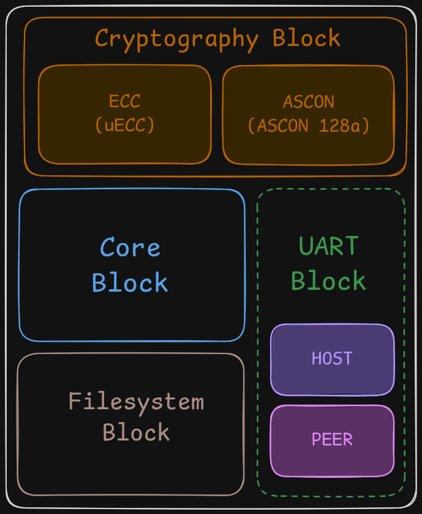

@page firmware_design Firmware

This section seeks to explain the core ideas used to build the firmware
components in sufficient technical detail. It seeks to convey the thought
process behind the design and architectural decisions taken in the project.
It also seeks to explain and justify the methodologies behind the working and
reliability of the system that enforces the security and functionality of the
firmware.

The entire scope of the project can be broken into 4 blocks. A block
independently performs some operation and gracefully yields control to
the next block. The flow of execution is tracked via a globally shared status
that is used by the core block to schedule the next block of operations in the
chain. Thus, the firmware is "incapable of crashing" as long as the individual
blocks themselves do not deadlock or cause a crash. Also the cause of a fault
can be easily be traced back to its source without any complex tooling or need
for complex debugging.



The system implements a two-layer authenticated encryption architecture. Layer 1
encrypts file content at rest using ASCON-128a under a per-file session key derived
through an asymmetric ECDH pipeline over P-256. Layer 2, active during peer-to-peer
transfer, independently encrypts the Layer 1 key bundle under a separate P-256 keypair.
The two keypairs are generated independently and share no algebraic relationship.

Each elliptic curve scalar multiplication is protected by three blinding mechanisms: additive scalar blinding (`scalar ← scalar + r·n`, TRNG-seeded), random projective Z-coordinate initialization, and an application-level multiplicative blinding via masked ASCON-XOF (`k_blind ← k · s mod n`, where `s` is derived from a device-embedded secret). The multiplicative blinding scalar `s` is computed as a secret-keyed function of per-invocation context, which incidentally provides structural resistance against the doubling attack: an adversary who recovers `k_blind` from a power trace obtains only a secret-masked version of the target scalar and cannot recover the underlying key without also recovering the embedded tweak secret. Security-critical branches are protected by a triple-redundancy arithmetic macro with compiler optimization suppressed. The PIN verification function is structured as a single-strike tripwire: any incorrect PIN attempt atomically zeroes a non-volatile flash field, triggering a self-erase on the next main loop iteration. Fault injection on the comparison logic fires the tripwire rather than bypassing it.


---

## 1. Introduction

Hardware Security Modules deployed in physically accessible environments must contend with an adversary capable of observing power consumption, injecting voltage faults, and manipulating external communication interfaces. These threats are qualitatively different from purely computational attacks: power side-channel analysis can recover scalar values from ECC implementations [5], voltage glitches can redirect conditional branches [9], and persistent non-volatile storage may retain sensitive state across power cycles.

A common approach to access control in embedded systems relies on a runtime-checked permission table. Such a structure presents a single point of compromise: a sufficiently precise flash modification can grant unauthorized access without breaking any cryptographic primitive. The present design eliminates this attack surface by encoding the permission structure in program control flow at build time, so that no permission table exists to modify.

A second vulnerability in multi-party file transfer systems is the exposure of at-rest key material during transfer. A single-layer design that encrypts content at rest and then transmits the at-rest session key over the peer channel reduces the effective security to the weaker of the two. The present design maintains strictly independent key hierarchies for the at-rest and in-transit layers, using keypairs generated independently with no algebraic relationship.

The contributions of this paper are as follows:

- A permission-enforcement architecture in which access rights are compiled into binary control flow by a build-time code generator, making permissions a static property of the linker output.
- A two-layer authenticated encryption scheme in which the at-rest (Layer 1) and in-transit (Layer 2) session keys are derived from independent P-256 keypairs. Compromise of either layer does not reduce the security of the other.
- A three-mechanism scalar blinding scheme in which the multiplicative blinding scalar is a secret-keyed function of per-invocation context. This design, motivated primarily by DPA resistance, also provides structural resistance against the doubling attack: recovery of the blinded scalar `k_blind` from power traces does not yield the underlying private key without also recovering the embedded tweak secret.

The paper is organized as follows. Section II provides background. Section III states the threat model. Section IV describes the system architecture. Section V describes the two-layer encryption design. Section VI describes the key derivation protocols. Section VII analyzes the scalar blinding scheme and its doubling attack properties. Section VIII describes fault injection countermeasures. Section IX describes software-level side-channel countermeasures. Section X covers the UART protocol. Section XI presents a security analysis against the defined adversary goals. Sections XII and XIII cover implementation details and limitations.

---

## 2. Background

### 2.1 Elliptic Curve Scalar Multiplication over GF(p)

An elliptic curve over a prime field GF(p) is defined as the set of affine points satisfying `y² = x³ + ax + b` with `4a³ + 27b² ≠ 0`, together with a point at infinity serving as the group identity. The group law defines point addition (ECA) and point doubling (ECD). Elliptic curve scalar multiplication (ECSM) computes `dP` for an integer scalar `d` and a curve point `P`, and forms the computational basis of ECDH-based key agreement.

The Montgomery ladder [7] computes ECSM by performing one ECA and one ECD per bit of the scalar, irrespective of the bit value. This balanced execution provides resistance against simple power analysis (SPA) and timing attacks based on operation counting [8]. However, as noted by Coron [3], the balanced structure does not preclude differential power analysis (DPA), because the intermediate points processed at each ladder step are deterministic functions of the secret scalar.

### 2.2 Differential Power Analysis on ECSM

DPA, introduced by Kocher et al. [5], exploits the statistical correlation between a device's instantaneous power consumption and the data values it processes. In the context of ECSM over the Montgomery ladder, the pair of points `(Q1, Q2)` maintained at each step depends on specific bits of the scalar `d`. An adversary who can collect power traces over many executions with varying input points can partition the traces by hypothesis on a bit of `d` and detect the correct hypothesis by its power correlation. The attack recovers the scalar iteratively, one bit at a time.

Coron [3] proposed *point blinding* as a countermeasure: the input point `P` is replaced by `P + R` for a random secret point `R`, and the true result `dP` is recovered as `d(P + R) - dR`. Since `R` is not known to the adversary, the intermediate points processed at each step are not predictable across traces, breaking the hypothesis-testing correlation on which DPA depends.

### 2.3 The Doubling Attack

The doubling attack, introduced by Fouque and Valette [2], is an adaptive chosen-input attack that breaks double-and-add-always algorithms with only two queries. It requires two executions: one on input point `P` and one on `2P`. The fundamental observation is that for an adversary who knows the doubling relationship between the two inputs, certain iterations of the ECSM ladder process the same point in both executions. This produces a detectable power correlation between specific samples of the two traces, from which bits of the secret scalar can be recovered iteratively.

Yen et al. [10] extended this attack to the Montgomery ladder specifically. Coron's basic point blinding is vulnerable to this extension because the second query on `2P` is processed as `2(P + R) = 2P + 2R`, which preserves the structural doubling relationship between the two executions. Ghosh et al. [11] proposed a modified random-point refreshment scheme `R ← (-1)^b · 3R` that explicitly defeats this attack by ensuring the second query cannot be framed as a doubling of the first.

### 2.4 ASCON

ASCON is a family of lightweight authenticated encryption and hashing algorithms selected by NIST as its Lightweight Cryptography standard [1]. The ASCON-128a variant provides 128-bit security for authenticated encryption with associated data. ASCON-XOF provides an extendable-output function used here for key derivation and scalar blinding. The `protected_bi32_armv6_leveled` implementation applies first-order Boolean masking with two shares throughout the permutation, providing first-order DPA resistance.

---

## 3. Threat Model

The adversary is assumed to have: physical access to the device and all external interfaces; the ability to observe power, electromagnetic, and timing side-channel leakage; the ability to inject voltage faults targeting conditional branches and return-value registers; and full control over both UART interfaces, including injected replays and malformed frames. The adversary may read the firmware binary.

The adversary does not have direct SRAM or flash read access without physical decapsulation. Second-order DPA against the masking scheme, laser fault injection on individual flash cells, and attacks requiring decapsulation are out of scope.

**Adversary goals:** obtain file plaintext without the read key; write to a file slot without the write key; receive a peer transfer without authorization; bypass PIN verification.

---

## 4. System Architecture

### 4.1 Component Structure

```
[UART0 / Host]  →  [Parser]  →  [Handler]  →  [Filesystem]
[UART1 / Peer]  ↔  [Parser]  ↔  [Handler]  →  [Filesystem]
                                     |
                         [secrets.c | uECC | ASCON-masked]
```

`parser.c` receives UART frames, verifies PIN, validates opcodes, and dispatches to handlers. It does not access key material. `handler.c` calls key selectors, invokes ASCON-128a, and calls load/store operations. It does not read UART directly. `secrets.c`, generated at build time, contains one key-generator function per authorized (group, operation) pair. All other pairs dispatch to `GenStub()`.

### 4.2 Flash Memory Layout

The flash address space is organized into four named sections:

| Section | Contents |
|---|---|
| `.fat` | 8 × `FS_FileEntry` (UUID, filesize, address) |
| `.metadata` | 8 × `FS_MetadataEntryFlash` (one sector per slot) |
| `.filedata` | 8 slots × 8 sectors × 1 KB = 64 KB file content |
| `.systemconf` | PIN attempt counter |

On every load operation, `Metadata_Table[slot].status.id` is compared against `FAT_Table.entry[slot].uuid` via `securecmp()`. An adversary who modifies one without the other fails this check; modifying both still requires forging a valid ASCON-128a authentication tag under the correct session key.

### 4.3 UART Frame Protocol

Frames take the form `[magic(1)] [opcode(1)] [body_len(2 LE)] [body...]`. The host interface uses magic byte `0x25`; the peer interface uses `0x5E`. `UART_RecvUntil(magic_byte)` scans for the framing byte before each command. Unknown opcodes cause the body bytes to be drained silently by passing a null output pointer, maintaining synchronization and preventing desynchronization from injected garbage frames.

---

## 5. Two-Layer Encryption Architecture

### 5.1 Design Rationale

A single-layer design that encrypts file content at rest and transmits the at-rest session key over the peer channel during transfer exposes the at-rest key to any adversary who controls or intercepts the peer UART. The present design addresses this by maintaining two independent key hierarchies: one for at-rest protection, and one for the transfer channel. The two keypairs `{priv_rw, pub_rw}` and `{priv_sr, pub_sr}` are generated independently at build time and have no algebraic relationship to each other.

### 5.2 Layer 1: At-Rest Encryption

`WriteHandler()` derives the Layer 1 session key (Section 6.1) and encrypts file content in place using ASCON-128a:

```c
ascon_aead_encrypt(
    tag_out  = &metadata.tag,
    ct_out   = &content,               // in-place, MAX_FILE_SIZE bytes
    pt_in    = &content,
    pt_len   = MAX_FILE_SIZE,
    ad       = filename ‖ FAT_entry,   // 56 bytes
    nonce    = metadata.nonce,         // TRNG-generated
    key      = derivedWriteKey
);
```

The 56-byte associated data binds the ciphertext to the filename and FAT entry. Any modification to the filename or FAT entry without knowledge of the session key causes authentication failure on decryption. The tag, ephemeral public key, nonce, and file identifier — all required for session key reconstruction — are stored in the metadata sector alongside the ciphertext.

`ReadHandler()` reconstructs the session key from the stored metadata (Section 6.2) and verifies the ASCON-128a tag before releasing any plaintext. Any modification to the ciphertext, tag, filename, or FAT entry results in a decryption error; no partial plaintext is output.

### 5.3 Layer 2: In-Transit Encryption

`SendHandler()` does not re-derive or expose the Layer 1 session key. Instead, it encrypts the complete Layer 1 key material bundle — 168 bytes comprising the Layer 1 ephemeral public key, nonce, file identifier, authentication tag, filename, FAT entry fields, and file size — under a separate session key derived from `{priv_sr, pub_sr}`. The file content travels as opaque Layer 1 ciphertext and is never decrypted, re-encrypted, or inspected during transit.

```c
ascon_aead_encrypt(
    tag_out = &preamble.tag,
    ct_out  = &metadata.key,           // 168-byte bundle, in-place
    pt_in   = &metadata.key,
    pt_len  = 168,
    ad      = preamble.nonce ‖ preamble.mesgid ‖ groupid_len,
    nonce   = preamble.nonce,
    key     = derivedSendKey
);
```

The `groupid` field is excluded from the plaintext but included in the AD, binding it cryptographically to the ciphertext and preventing cross-group replay.

### 5.4 Independence of the Two Layers

An adversary who fully compromises Layer 2 — recovering `derivedSendKey` and decrypting the 168-byte envelope — obtains the Layer 1 ephemeral public key `eph_pub_L1`, nonce, file identifier, and authentication tag. Deriving the Layer 1 session key from these values requires computing `ECDH(eph_pub_L1, priv_rw)`, which requires `priv_rw`. Under the CDH assumption over P-256, recovering `priv_rw` from `eph_pub_L1` is computationally infeasible. Since `priv_rw` and `priv_sr` are independent keypairs, compromising one does not reduce the difficulty of the other.

Conversely, an adversary who recovers the Layer 1 session key for a specific file obtains no information about Layer 2 keys (different keypair, different derivation context) and no information about Layer 1 session keys for other files (each uses a fresh TRNG-generated ephemeral keypair).

---

## 6. Key Derivation Protocols

### 6.1 Cryptographic Primitives and Provisioning

The system uses ASCON-128a (masked) for both AEAD layers, ASCON-XOF (masked) as a KDF and scalar derivation primitive, and uECC over P-256 for all elliptic curve operations. The uECC TRNG interface is connected to the TI MSPM0L2228 hardware TRNG via `uECC_set_rng()`. The TRNG discards its first 128 output words on initialization and verifies the NIST SP 800-90B health tests (repetition count and adaptive proportion) before any key material is derived; a health test failure halts the system.

The build-time script `gen_secrets.py` provisions per group: two independent P-256 keypairs (`{priv_rw, pub_rw}` for read/write; `{priv_sr, pub_sr}` for send/recv); 16-byte TRNG-generated tweak secrets (`tweak_rw`, `tweak_sr`) for derivation context binding; and a 16-byte global `interrogate_secret` for FAT exchange. Write-side devices receive only `pub_rw`; read-side devices receive only `priv_rw`.

### 6.2 Compiled Generator Functions

`derive_secrets.py` generates `secrets.c`, containing one `static` generator function per authorized (group, operation) pair. For each function, the relevant key material (`master_pub`, `master_priv`, or `tweak_secret`) is declared `static const` within the function body, causing the compiler to emit it as read-only flash data scoped to that function — not loaded into SRAM at boot, accessed only during an active invocation. Each generator disables interrupts for the full scalar derivation and ECDH pipeline and wipes all intermediate values on both success and error return paths.

For unauthorized pairs, the dispatch function routes to `GenStub()`:

```c
StatusCode SelectWriteKey(uint16_t groupid, uint8_t key[ASCON_KEY_SIZE]) {
    switch (groupid) {
    case GROUP_A: return GenWriteKey_GROUPA(key);
    case GROUP_B: return GenStub();   // not authorized for write
    default:      return GenStub();
    }
}
```

No runtime permission state exists. An adversary who patches flash cannot grant write access to an unpermitted group because no `GenWriteKey` function for that group was compiled into the binary.

### 6.3 Write-Side Key Derivation

Let `master_pub = pub_rw`, `tweak_w = tweak_rw`. The parser places a TRNG-generated `fileid` into the staging area before invocation.

```
1.  ctx ← { nonce: TRNG(16B), id: fileid, masterKey: tweak_w }
2.  s   ← ASCON-XOF-masked(ctx)                        // 32-byte P-256 scalar
3.  (eph_priv, eph_pub) ← uECC_make_key()
4.  k_blind ← eph_priv · s  mod n
5.  shared  ← uECC_shared_secret(master_pub, k_blind)
6.  key_w   ← ASCON-XOF("FS-ASCON-KDF" ‖ shared ‖ "AEAD-KEY")
7.  metadata.key ← eph_pub;  metadata.nonce ← ctx.nonce
8.  Wipe: ctx, s, eph_priv, eph_pub, k_blind, shared
```

### 6.4 Read-Side Key Derivation

Let `master_priv = priv_rw`. The stored metadata provides `eph_pub`, `nonce`, and `fileid`.

```
1.  ctx ← { nonce: metadata.nonce, id: fileid, masterKey: tweak_w }
2.  s   ← ASCON-XOF-masked(ctx)
3.  k_blind ← master_priv · s  mod n
4.  shared  ← uECC_shared_secret(eph_pub, k_blind)
            = (eph_priv · priv_rw · s) · G    // equals write-side result
5.  key_r   ← ASCON-XOF("FS-ASCON-KDF" ‖ shared ‖ "AEAD-KEY")
```

**Correctness.** The write side computes `(priv_rw · eph_priv · s)·G`; the read side computes `(eph_priv · priv_rw · s)·G`. These are equal by commutativity of scalar multiplication over the elliptic curve group.

### 6.5 Send/Receive Key Derivation

The send-side generator holds `pub_sr` and follows the structure of Section 6.3, generating a fresh `ctx.nonce` and `ctx.id` from the TRNG. The recv-side generator holds `priv_sr` and follows the structure of Section 6.4, reading `nonce` and `mesgid` from the received preamble. The correctness argument is identical to Section 6.4.

---

## 7. Scalar Blinding

Every ECC scalar multiplication in the system is subjected to three blinding mechanisms. These are described in order, followed by an analysis of their combined properties including their relationship to the doubling attack.

### 7.1 Mechanism 1: Additive Scalar Blinding (uECC)

Within `uECC.c`, the function `vli_blindScalar()` is called before every point multiplication:

```
blinded_scalar ← scalar + r · n
```

where `n` is the P-256 group order and `r` is a 32-bit TRNG word. Since `n·P = O`, the result is identical to `scalar·P`, but the scalar presented to the Montgomery ladder differs per invocation, decorrelating the power trace from the scalar bits. This applies within both `uECC_make_key()` and `uECC_shared_secret()`.

### 7.2 Mechanism 2: Random Projective Z-Coordinate Initialization (uECC)

Before each `EccPoint_mult()`, a TRNG-sampled value `random_Z` is passed as the initial projective Z-coordinate. The Montgomery ladder operates in projective coordinates `(X:Y:Z)`. Randomizing the initial Z causes all intermediate projective point representations to differ across invocations, independent of the scalar value. This countermeasure was described by Joye and Tymen [6] and applies within both `uECC_make_key()` and `uECC_shared_secret()`.

### 7.3 Mechanism 3: Multiplicative Scalar Blinding via Secret-Keyed XOF

The generator functions in `secrets.c` apply a multiplicative blinding at the application level. A blinding scalar `s` is derived using the masked ASCON-XOF:

```
s ← ASCON-XOF-masked(ctx.nonce ‖ ctx.masterKey ‖ ctx.id)
```

where `ctx.masterKey = tweak_secret` is a group-specific 16-byte value embedded as `static const` in the generator function and unknown to the adversary. The scalar entering `uECC_shared_secret()` is `k_blind = k · s mod n`, where `k` is `eph_priv` on the write/send side or `master_priv` on the read/recv side.

Two properties follow from the secret-keyed construction of `s`:

**(a) Key isolation.** An adversary who recovers `k_blind` from a power trace cannot recover `k` without also knowing `s`. Since `s` is derived through a secret-keyed XOF (with `tweak_secret` as the key), recovering `s` requires recovering `tweak_secret`, which is a distinct embedded secret not accessible in SRAM except during an active generator invocation.

**(b) Per-invocation independence.** Each invocation uses a distinct `ctx.nonce` and `ctx.id`, producing a distinct `s` and therefore a distinct `k_blind`, even when `k = master_priv` is static (as on the read/recv side). The masked ASCON-XOF derivation of `s` is itself first-order DPA-resistant.

### 7.4 Relationship to the Doubling Attack

The doubling attack requires the adversary to submit two queries with the same effective scalar applied to input points `P` and `2P`, and to correlate the resulting power traces to recover the scalar.

On the **write and send sides**, the scalar entering `uECC_shared_secret()` is `k_blind = eph_priv · s`, where `eph_priv` is freshly generated by `uECC_make_key()` on every invocation. There is no static scalar to correlate across queries. The doubling attack has no applicable target.

On the **read side**, `master_priv` is static. However, the scalar entering `uECC_shared_secret()` is `k_blind = master_priv · s`, and the input point `eph_pub` is set by the write-side device and stored in flash — the adversary cannot manufacture two files whose ephemeral public keys satisfy `eph_pub_2 = 2 · eph_pub_1` without possessing the write key. The doubling attack therefore has no way to construct the required pair of queries.

The **recv side** presents the only case in which the adversary controls the input point: `preamble.key` is received directly from the peer UART. An adversary could in principle submit two receive requests with `preamble.key = P` and `preamble.key = 2P` while holding `preamble.nonce` and `preamble.mesgid` fixed, ensuring `s_1 = s_2` and thus `k_blind_1 = k_blind_2`. Such a pair of traces could, in principle, support a doubling attack correlation.

However, even if this correlation succeeds and the adversary recovers `k_blind`, the key isolation property (Section 7.3a) applies directly: `k_blind = local_priv · s mod n` where `s` is unknown to the adversary. Recovering `local_priv` from `k_blind` without `s` is equivalent to inverting the product of two unknown scalars modulo the group order, which is computationally equivalent to recovering `local_priv` directly. The multiplicative blinding by a secret-keyed scalar therefore provides structural resistance against the doubling attack: the attack can proceed as far as recovering `k_blind`, but cannot extract the underlying private key from it.

This resistance property is a consequence of the same design decision — binding `s` to a device-embedded `tweak_secret` — that was motivated primarily by DPA resistance. It is not an incidental side effect but a direct consequence of the secret-keyed structure of Mechanism 3.

### 7.5 Combined Blinding Coverage

For write/send operations:

| Step | Operation | Mechanisms active |
|---|---|---|
| `uECC_make_key()` | `eph_pub = (eph_priv + r·n)·G` | §7.1, §7.2 |
| `uECC_mod_mult()` | `k_blind = eph_priv · s` | §7.3 |
| `uECC_shared_secret()` | `shared = (k_blind + r'·n)·master_pub` | §7.1, §7.2, §7.3 |

For read/recv operations the first step is absent; the second step uses `master_priv` in place of `eph_priv`. Recovering `master_priv` requires defeating the additive scalar blinding, the projective Z-randomization, and the secret-keyed multiplicative blinding simultaneously, as each mechanism is independent.

---

## 8. Fault Injection Countermeasures

### 8.1 Triple-Redundancy Conditional Macro

All security-critical conditionals use the `IF`/`ENDIF` macro from `common.h`:

```c
#define SECPASS 0x5A5AA5A5U
#define SECFAIL 0xA5A55A5AU

#define IF(cond)                                                   \
    _Pragma("clang optimize off")                                  \
    {                                                              \
        uint32_t _cond   = (cond);                                 \
        uint32_t _check1 = SECFAIL + _cond*(SECPASS-SECFAIL);      \
        uint32_t _check2 = SECFAIL + _cond*(SECPASS-SECFAIL);      \
        uint32_t _check3 = SECFAIL + _cond*(SECPASS-SECFAIL);      \
        if (_check1==SECPASS && _check2==SECPASS && _check3==SECPASS)

#define ENDIF  } _Pragma("clang optimize on")
```

`_Pragma("clang optimize off")` prevents the compiler from folding the three evaluations into a single operation under `-Ofast` or LTO. Each `_checkN` is a distinct SRAM write and read. The encoding maps a Boolean condition to the full 32-bit domain: condition 0 maps to `SECFAIL = 0xA5A55A5A` and condition 1 maps to `SECPASS = 0x5A5AA5A5`. The two values are bitwise complements (Hamming distance 32), so common contiguous-byte glitch patterns that corrupt `SECFAIL` are unlikely to produce `SECPASS`. For a fault to bypass the check, it must independently produce the 32-bit value `0x5A5AA5A5` in all three `_checkN` variables within the same glitch window, a probability of approximately 2⁻⁹⁶ for independent uniform faults.

### 8.2 RAMFUNC Placement and SRAM Execution Boundary

`FLASH_Write`, `FLASH_Erase`, `FLASH_ReadSector`, and `memclear()` are placed in `.TI.ramfunc` and declared `__attribute__((noinline))`. The startup code copies this section to SRAM, preventing instruction-fetch contention during flash operations and ensuring the self-erase path cannot be defused by patching these functions in flash.

`DL_SYSCTL_setSRAMBoundaryAddress()` partitions 32 KB SRAM into two hardware-enforced regions:

- **Lower (~28 KB): RW, No-Execute.** Data, BSS, stack, and the volatile staging buffer. An adversary who achieves a write primitive in this region cannot execute injected code.
- **Upper (~4 KB): RX, No-Write.** The `.TI.ramfunc` section. An adversary with code execution in the data region cannot corrupt `FLASH_Erase` or `memclear()`, as writes to this region are hardware-blocked.

### 8.3 PIN Verification and Brute-Force Countermeasure

`checkpin()` performs two independent comparisons:

```c
bool valid1 = (storedPin_64bit == inputPin_64bit);  // integer comparison
bool valid2 = securecmp(HSM_PIN, inputPin, 6);       // masked ASCON-XOF hash comparison
uint64_t value = 0 - (uint64_t)(valid1 && valid2);
DL_FlashCTL_programMemoryBlocking64WithECCGenerated(
    FLASHCTL, &SystemStatus.timeout, (uint32_t*)&value, 2, MAIN);
```

`SystemStatus.timeout` is a single `uint64_t` provisioned as `0xFFFFFFFFFFFFFFFF`. A correct PIN yields `value = 0xFFFFFFFFFFFFFFFF` — the flash write is a no-op, leaving the field unchanged. An incorrect PIN yields `value = 0x0000000000000000`, atomically bit-clearing the entire 64-bit field in a single flash program operation, without a preceding sector erase. This write is non-volatile and power-cycle-resistant. The mechanism is a **single-strike tripwire**: any incorrect PIN attempt permanently zeros the timeout field.

The main loop checks `IF(SystemStatus.timeout == 0)` on every iteration. When the field has been zeroed, the loop applies a 4.5-second delay — permitting a legitimate operator to interrupt by power-cycling — and then erases the `systemconf` sector.

If an adversary faults either comparator to produce `valid1 ≠ valid2`, the conjunction evaluates to false, `value` is set to zero, and the tripwire fires. Fault injection on the comparison is therefore self-defeating: it triggers the erase condition rather than bypassing it.

### 8.4 Brownout Detection

`SYSCFG_DL_SYSCTL_init()` configures the on-chip brownout detector at Level 3 (~2.7 V). On the MSPM0L2228, a BOR event raises a Non-Maskable Interrupt that halts the device until an external hard reset. This imposes a physical interaction requirement between each voltage-glitch attempt and the next, preventing automated glitch-and-retry loops.

---

## 9. Side-Channel Countermeasures

### 9.1 First-Order Masked ASCON

`protected_bi32_armv6_leveled` applies a two-share Boolean masking scheme with `NUM_SHARES = 2` for all state words. No unmasked intermediate word is materialized in a single register during the nonlinear (S-box) or linear diffusion layers. This provides first-order DPA resistance for AEAD encryption/decryption, XOF-based blinding scalar derivation, and the hash-based comparison in `securecmp()`.

### 9.2 Hash-Based Constant-Time Comparison

`securecmp()` avoids direct byte comparison:

```c
ascon_xof_masked(ahash, CRYPTO_ABYTES, a, size);
ascon_xof_masked(bhash, CRYPTO_ABYTES, b, size);
uint8_t result = 0;
for (uint32_t i = 0; i < CRYPTO_ABYTES; ++i)
    result |= ahash[i] ^ bhash[i];
memclear(ahash, ...); memclear(bhash, ...);
return result == 0;
```

Comparison time is independent of the number of matching leading bytes, input length up to the XOF absorption capacity, and contains no data-dependent branches in the accumulation loop.

### 9.3 Interrupt Isolation and Intermediate Value Erasure

Each generator function disables interrupts (`__disable_irq()`) for the full scalar derivation and ECDH pipeline, preventing UART ISR context switches from interleaving power traces or corrupting intermediate SRAM values. All intermediates (`ctx`, `s`, `eph_priv`, `eph_pub`, `k_blind`, `sharedSecret_raw`) are wiped using `memclear()` on both the success path and every error return path. `memclear()` uses `volatile` pointer semantics to prevent the compiler from eliding writes to values that go out of scope.

---

## 10. UART Protocol

### 10.1 Frame Synchronization and Flow Control

Frames: `[magic(1)] [opcode(1)] [body_len(2 LE)] [body...]`. Host magic: `0x25`. Peer magic: `0x5E`. `UART_RecvUntil(magic_byte)` scans for framing before each command. Unknown opcodes drain the body silently via a null output pointer, maintaining synchronization against injected garbage.

Bulk transfers use a windowed ACK scheme to prevent ring-buffer overflow during 8192-byte file transfers (`Host ACK: {0x25, 0x41, 0x00, 0x00}`). The sender pauses every `UART_BUFFER_SIZE` bytes and waits for an ACK. The ACK scanner uses a stateful pattern-match that tolerates interleaved garbage bytes accumulated during mid-transfer flash writes. The `dirty` flag prevents spurious ACKs if `UART_RecvUntil()` has already consumed bytes in the current window.

### 10.2 Peer Sub-Protocol

Errors are returned as structured frames `[magic, 'E', statusCode(2)]`, allowing the initiating HSM to report peer errors to the host rather than stalling. `ListenParser` waits for either `INTERROGATE` or `RECEIVE` and dispatches accordingly, permitting any HSM to initiate or respond to a transfer without prior host coordination.

---

## 11. Security Analysis

The following assumptions are used: **CDH** — the computational Diffie-Hellman problem over P-256 is hard; **ASCON-Secure** — ASCON-128a is a secure AEAD with no forgery advantage beyond 2⁻¹²⁸; **XOF-PRF** — ASCON-XOF behaves as a pseudorandom function family.

### 11.1 Unauthorized File Reception

`SelectRecvKey(G) → GenStub() → PERMISSIONERROR` for any group without recv permission. Independently decrypting the Layer 2 ciphertext requires `priv_sr`; under CDH this is infeasible from the transmitted ephemeral public key. Even conditional on breaking Layer 2, recovering the Layer 1 session key from `eph_pub_L1` requires `priv_rw` — an independent CDH problem on a separate keypair on a physically distinct device.

### 11.2 Unauthorized Local Read

`SelectReadKey(G) → GenStub()` unconditionally through the normal interface. Offline decryption via a second authorized device fails because session keys are bound to per-file TRNG-generated `(nonce, fileid, eph_priv)` triples; a second device derives the key for its own metadata, not the target's. The write-side API unconditionally generates fresh TRNG material, so injecting target metadata via write is not possible. Fault injection on the `PERMISSIONERROR` check faces the triple-redundancy macro (~2⁻⁹⁶), and `GenStub` writes nothing to the key buffer — a subsequent ASCON decrypt under an uninitialized key fails tag verification at a separate `IF`/`ENDIF`-guarded check.

### 11.3 PIN Bypass

Every host-initiated operation calls `checkpin()` before any handler runs. As argued in Section 8.3, fault injection on either comparator fires the tripwire rather than granting access. The timeout field is zeroed in a single non-volatile atomic flash write that persists across power cycles; there is no multi-attempt budget to exhaust gradually.

### 11.4 Unauthorized Write

Without physical access, every write through the UART either requires valid credentials (authorized) or passes through `GenWriteKey`, which generates fresh TRNG-derived `(nonce, fileid, eph_priv)` regardless of input. Replayed frames are re-encrypted under a new session key; the stored tag is valid only for the new ciphertext. Under ASCON-Secure, constructing a valid (ciphertext, tag) pair without the session key has negligible advantage.

---

## 12. Implementation Notes

**Dual toolchain.** TI Clang compiles the main firmware with `-Ofast -flto`. ARM GCC compiles uECC and masked ASCON with `-Ofast` (no LTO; the two toolchains use incompatible LTO IR formats). Both use `-march=armv6-m`.

**Cortex-M0+ alignment.** The M0+ core faults on unaligned 32-bit accesses. All `PACKED` structures are accessed through `memcpy()` into aligned buffers. The flash sector buffer is `__attribute__((aligned(8)))` for TI FlashCTL 64-bit alignment. `-Wcast-align` catches violations at compile time.

**Volatile staging.** A single `volatile FS_Stage stage` is wiped by `memclear()` at the top of each main loop iteration, preventing partial state from faulted operations from persisting.

---

## 13. Application Context

The system described in this paper was designed and implemented as an entry for the MITRE Embedded Capture the Flag (ECTF) 2026 competition. The ECTF competition specifies a physical adversary model, a set of attack goals, and an evaluation framework against which competing HSM implementations are assessed. The design decisions described here — the compiled permission structure, the two-layer key hierarchy, the fault-injection-hardened PIN trap, and the secret-keyed multiplicative scalar blinding — were each motivated by the ECTF 2026 adversary model and competition rules. The implementation targets the TI MSPM0L2228 evaluation platform as specified by the competition.

---

## References

[1] Dobraunig, C., Eichlseder, M., Mendel, F., and Schläffer, M. "Ascon v1.2." NIST Lightweight Cryptography Standard, 2023.

[2] Fouque, P.-A. and Valette, F. "The doubling attack — why upwards is better than downwards." *Proc. CHES 2003*, LNCS 2779, pp. 269–280, 2003.

[3] Coron, J.-S. "Resistance against differential power analysis for elliptic curve cryptosystems." *Proc. CHES 1999*, LNCS 1717, pp. 292–302, 1999.

[4] Joye, M. and Tymen, C. "Protections against differential analysis for elliptic curve cryptography." *Proc. CHES 2001*, LNCS 2162, pp. 377–390, 2001.

[5] Kocher, P., Jaffe, J., and Jun, B. "Differential power analysis." *Proc. CRYPTO 1999*, LNCS 1666, pp. 388–397, 1999.

[6] Kocher, P. C. "Timing attacks on implementations of Diffie-Hellman, RSA, DSS and other systems." *Proc. CRYPTO 1996*, LNCS 1109, pp. 104–113, 1996.

[7] Montgomery, P. L. "Speeding the Pollard and elliptic curve methods of factorization." *Mathematics of Computation*, vol. 48, pp. 243–264, 1987.

[8] Okeya, K. and Sakurai, K. "Power analysis breaks elliptic curve cryptosystems even secure against the timing attack." *Proc. Indocrypt 2000*, LNCS 1977, pp. 178–190, 2000.

[9] Barenghi, A., Breveglieri, L., Koren, I., and Naccache, D. "Fault injection attacks on cryptographic devices: Theory, practice, and countermeasures." *Proceedings of the IEEE*, vol. 100, no. 8, pp. 3056–3076, 2012.

[10] Yen, S.-M., Ko, L.-C., Moon, S.-J., and Ha, J.-C. "Relative doubling attack against Montgomery ladder." *Proc. ICISC 2005*, LNCS 3935, pp. 117–128, 2006.

[11] Ghosh, S., Mukhopadhyay, D., and Roychowdhury, D. "Petrel: Power and timing attack resistant elliptic curve scalar multiplier based on programmable GF(p) arithmetic unit." *IEEE Transactions on Circuits and Systems I: Regular Papers*, vol. 58, no. 8, pp. 1798–1812, 2011.

[12] Mackay, K. micro-ecc. Available: https://github.com/kmackay/micro-ecc

[13] Texas Instruments. *MSPM0L2228 Technical Reference Manual*. 2024.

[14] MITRE Corporation. *ECTF 2026 Rules and Adversary Model*. 2026.

[15] Mangard, S., Oswald, E., and Popp, T. *Power Analysis Attacks: Revealing the Secrets of Smart Cards*. Springer, 2007.

[16] Hankerson, D., Menezes, A., and Vanstone, S. *Guide to Elliptic Curve Cryptography*. Springer, 2003.
